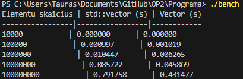
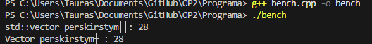
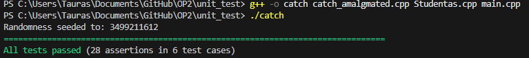
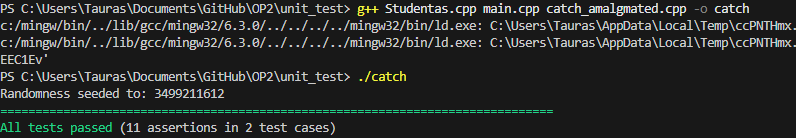
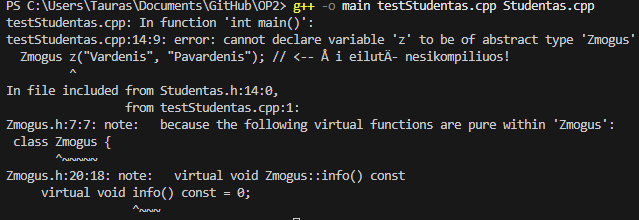
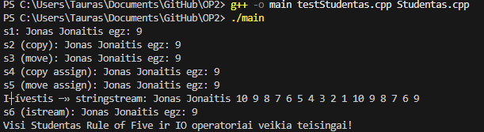

# OP
Objektinis Programavimas

## Naudojimosi instrukcija

1. Atsisiųskite (arba nuklonuokite) šį projektą į savo kompiuterį.
2. Atidarykite terminalą tame aplanke.
Pvz. C:\Users\Public\Documents\GitHub\OP2
3. Programos paleidimas (įveskite į terminalą): 
mkdir build
cd build
cmake ..
cmake --build .
cd Debug
./main.exe
4. Vykdykite programos nurodymus terminale:
   - Pasirinkite veiksmą (failų generavimas, duomenų įvedimas, skaitymas iš failo ir t.t.).
   - Pasirinkite rūšiavimo būdą.
   - Įveskite failo pavadinimą, jei reikia.
5. Rezultatai bus išsaugoti į `vargsai.txt` ir `kietakai.txt` failus.


# v3.0 Aprašymas

## Instaliavimo instrukcijos

1. Parsisiųskite `Setup.exe` iš šios repozitorijos.
2. Paleiskite atsisiųstą failą.
3. Suteikite administratoriaus privilegijas.
4. Visur spauskite mygtuką „Next“.
5. Programa automatiškai bus įdiegta į `C:\Program Files (x86)\VU\Tauras-Petrauskas`.
6. Programą paleisite dukart spustelėję darbalaukio ikoną arba per meniu juostą **VU → Tauras Petrauskas**.


---

## Vector<T> funkcionalumo pavyzdžiai

Toliau pateikiami kelių funkcijų palyginimo pavyzdžiai – rezultatai identiški kaip ir su std::vector:

```cpp
// push_back ir operator[]
Vector<int> v;
v.push_back(10);
v.push_back(20);
std::cout << v[1] << std::endl; // 20
```

* push_back prideda elementą į vektoriaus pabaigą.
* operator[] leidžia pasiekti elementą pagal indeksą.

```cpp
// insert
Vector<int> v2 = {1, 2, 4};
v2.insert(v2.begin() + 2, 3); // v2: 1 2 3 4
```

* insert įterpia naują elementą į nurodytą vietą.

```cpp
// erase
Vector<int> v3 = {1, 2, 3, 4};
v3.erase(v3.begin() + 1); // v3: 1 3 4
```

* erase pašalina elementą pagal nurodytą poziciją.

```cpp
// assign
Vector<int> v4;
v4.assign(5, 7); // v4: 7 7 7 7 7
```

* assign užpildo vektorių nurodytu kiekiu vienodų reikšmių.

```cpp
// operator==
Vector<int> v5 = {1, 2, 3};
Vector<int> v6 = {1, 2, 3};
bool eq = (v5 == v6); // true
```

* operator== patikrina, ar du vektoriai yra lygūs.

# Spartos analizė

naudojamas bench.cpp failas su tam tikru skaičiumi elementų(užkomentuota dalis).

|Elementu skaicius | std::vector (s) | Vector (s)|
-----------------|-----------------|------------|
|10000           | 0.000000      | 0.000000|
|100000           | 0.000997      | 0.001019|
|1000000           | 0.010447      | 0.006265|
|10000000           | 0.085722      | 0.045869|
|100000000           | 0.791758      | 0.431477|



Abu konteineriai veikia labai greitai, tačiau mano Vector kai kuriais atvejais veikia net greičiau dėl paprastesnės realizacijos. std::vector turi daugiau saugumo ir papildomų galimybių, todėl realiose situacijose skirtumas gali būti mažesnis arba std::vector gali būti greitesnis su optimizacijomis.

# Atminties perskirstymai

|Elementu skaicius | std::vector perskirstymų | Vector perskirstymų|
-----------------|-----------------|------------|
|100000000           | 28      | 28       |



Užpildant 100 000 000 elementų, tiek std::vector, tiek mano Vector klasė atmintį perskirstė 28 kartus, todėl jų efektyvumas atminties valdymo prasme yra praktiškai identiškas.

# Spartos analizė 2

studentai100000.txt
| Konteineris | nuskaitymo trukmė  | skirstymo į dvi grupes trukmė | rūšiavimo didėjimo tvarka trukmė |
|----|--------------------|-------------------------|--------------------------------|
| std::vector  |  0.625739 s  |  0.032274 s  |  0.422755 s  |  
| Vector       |  0.605669 s  |  0.069709 s  |  0.196052 s | 

studentai1000000.txt
| Konteineris | nuskaitymo trukmė  | skirstymo į dvi grupes trukmė | rūšiavimo didėjimo tvarka trukmė | 
|----|--------------------|-------------------------|--------------------------------|
| std::vector  |  6.51211 s  |  0.389969 s  |  5.55069 s  | 
| Vector       |  5.939 s  |  0.755909 s  |  2.46786 s | 

studentai10000000.txt
| Konteineris | nuskaitymo trukmė  | skirstymo į dvi grupes trukmė | rūšiavimo didėjimo tvarka trukmė |
|----|--------------------|-------------------------|--------------------------------|
| std::vector  |  59.81252 s   |  3.89258 s  |  54.50758 s  |  
| Vector       |  54.32189 s  |  7.15958 s  |  23.67893 s  |  

# Unit testing

atliktas unit_test aplanke



## Sukurta dokumentacija naudojant [Doxygen](https://www.doxygen.nl/index.html)

### Kaip naudotis šia dokumentacija?

Dokumentaciją galima peržiūrėti dviejais būdais:

+ Kaip ```.html``` failą
+ Kaip ```.pdf``` failą

+ Norint dokumentaciją peržiūrėti kaip ```.html``` failą, jums reikės jį atsidaryti bet kurioje naršyklėje.\
Šis failas yra šioje lokacijoje: ```/Dokumentacija/hmtl/index.html```
+ Norint dokumentaciją peržiūrėti kaip ```.pdf``` failą, jums reikės jį atsidaryti bet kurioje ```.pdf``` failus skaitančioje programoje.\
Šis failas yra šioje lokacijoje: ```/Dokumentacija/latex/OP3.pdf```

# v2.0 Aprašymas

## Sukurti unit testai naudojant [Catch2](https://github.com/catchorg/Catch2)

### Kas yra tikrinama unit testuose?

Unit testuose yra tikrinamas klasės **Student1** funkcionalumas ir veikimas.

Specifiškai yra tikrinami:

+ Setter'iai
+ Default konstruktorius
+ Copy konstruktorius
+ Copy assignment operatorius
+ Move konstruktorius
+ Move assignment operatorius



## Sukurta dokumentacija naudojant [Doxygen](https://www.doxygen.nl/index.html)

### Kaip naudotis šia dokumentacija?

Dokumentaciją galima peržiūrėti dviejais būdais:

+ Kaip ```.html``` failą
+ Kaip ```.pdf``` failą

+ Norint dokumentaciją peržiūrėti kaip ```.html``` failą, jums reikės jį atsidaryti bet kurioje naršyklėje.\
Šis failas yra šioje lokacijoje: ```/Dokumentacija/hmtl/index.html```
+ Norint dokumentaciją peržiūrėti kaip ```.pdf``` failą, jums reikės jį atsidaryti bet kurioje ```.pdf``` failus skaitančioje programoje.\
Šis failas yra šioje lokacijoje: ```/Dokumentacija/latex/OP2.pdf```

# v1.5 Aprašymas

## Klasės paveldėjimas

- Sukurta abstrakti bazinė klasė `Zmogus`, iš kurios paveldima klasė `Studentas`.
- Negalima sukurti `Zmogus` objekto – tik išvestinės klasės objektus (pvz., `Studentas`).

**Žmogaus klasės objektų kūrimas negalimas**



# v1.2 Aprašymas

Sistema: Intel i9-14900HX, 32GB RAM, SSD 1000GB, Windows 11

## Studentas klasės perdengti metodai

| Metodas                  | Paskirtis                                                                 |
|--------------------------|---------------------------------------------------------------------------|
| Studentas()              | Numatytasis konstruktorius                                                |
| Studentas(args...)       | Pilnas konstruktorius                                                     |
| ~Studentas()             | Destruktorius                                                             |
| Studentas(const&)        | Kopijavimo konstruktorius                                                 |
| Studentas(Studentas&&)   | Perkėlimo (move) konstruktorius                                           |
| operator=(const&)        | Kopijavimo priskyrimo operatorius                                         |
| operator=(Studentas&&)   | Perkėlimo (move) priskyrimo operatorius                                   |
| operator>>(istream&, Studentas&) | Duomenų įvedimas iš srauto (failo, ekrano, stringstream ir pan.)   |
| operator<<(ostream&, const Studentas&) | Duomenų išvedimas į srautą (failą, ekraną, stringstream ir pan.) |


### Duomenų įvedimas

- **Rankiniu būdu:** per programos meniu galima įvesti studentų duomenis klaviatūra.
- **Automatiškai:** galima generuoti atsitiktinius studentų duomenis.
- **Iš failo:** galima nuskaityti studentų duomenis iš failo (pvz., studentai10000.txt).

### Duomenų išvedimas

- **Į ekraną:** studentų rezultatai gali būti atvaizduojami terminale.
- **Į failą:** rezultatai gali būti išsaugomi į failus (pvz., vargsai.txt, kietakai.txt).

### Testavimas

Visi metodai patikrinti su testStudentas.cpp:
- Tikrinami visi konstruktoriai, priskyrimo operatoriai, įvesties/išvesties operatoriai.
- Testo išvestis (pavyzdys):

```
s1: Jonas Jonaitis egz: 9
s2 (copy): Jonas Jonaitis egz: 9
s3 (move): Jonas Jonaitis egz: 9
s4 (copy assign): Jonas Jonaitis egz: 9
s5 (move assign): Jonas Jonaitis egz: 9
Išvestis į stringstream: Jonas Jonaitis 10 9 8 7 6 5 4 3 2 1 10 9 8 7 6 9                
s6 (istream): Jonas Jonaitis egz: 9
Visi Studentas Rule of Five ir IO operatoriai veikia teisingai!
```

**Papildomai:** 



# v1.1 Aprašymas

## Kompiliatoriaus optimizavimo flag'ų (O1, O2, O3) įtaka

Eksperimentas atliktas su komanda:
- `g++ -O1 -o main_O1 main.cpp Studentas.cpp`
- `g++ -O2 -o main_O2 main.cpp Studentas.cpp`
- `g++ -O3 -o main_O3 main.cpp Studentas.cpp`

Testuota su failais: studentai100000.txt ir studentai1000000.txt  
Sistema: Intel i9-14900HX, 32GB RAM, SSD 1000GB, Windows 11

## Class:

| Optimizavimo lygis | studentai100000.txt rūšiavimo trukmė | studentai1000000.txt rūšiavimo trukmė | exe failo dydis |
|--------------------|--------------------------------------|---------------------------------------|-----------------|
| -O0 (be optimiz.)  | 0.276829 s                               | 3.32324 s                                | 290 KB  |
| -O1                | 0.102687 s                               | 1.25678 s                                | 178 KB   |
| -O2                | 0.09735 s                               | 1.22385 s                                | 188 KB    |
| -O3                | 0.104992 s                               | 1.23305 s                                | 189 KB   |

## Struct:

| Optimizavimo lygis | studentai100000.txt rūšiavimo trukmė | studentai1000000.txt rūšiavimo trukmė | exe failo dydis |
|--------------------|--------------------------------------|---------------------------------------|-----------------|
| -O0 (be optimiz.)  | 0.395714 s                               | 5.51937 s                                | 318 KB  |
| -O1                | 0.08385 s                               | 1.12748 s                                | 186 KB   |
| -O2                | 0.074694 s                              | 1.04977 s                                | 191 KB    |
| -O3                | 0.076067 s                               | 1.08089 s                               | 192 KB   |

**Išvada:**  
Kompiliatoriaus optimizavimo flag'ai (-O1, -O2, -O3) žymiai pagreitina rūšiavimo vykdymą.  
Didžiausias pagreitėjimas matomas prie -O2.  
Optimizuotas struct yra šiektiek greitesnė rūšiuojant už class.
Rekomenduojama naudoti bent -O2 galutiniam programos variantui.


## Testavimas atliekamas su tais pačiais failais iš 100000, 1000000 įrašų.
Sistemos parametrai:
Intel i9-14900HX
32GB RAM
SSD 1000GB

Duomenų apdorojimas:

3 Strategija: Bendro studentai konteinerio skaidymas (rūšiavimas) į du naujus konteinerius, naudojant "efektyvius" darbo su konteineriais metodus.

studentai100000.txt
| Konteineris | nuskaitymo trukmė  | skirstymo į dvi grupes trukmė | rūšiavimo didėjimo tvarka trukmė | 
|----|--------------------|-------------------------|--------------------------------|
| vector  |  0.658439 s  |  0.037274 s  |  0.411755 s  | 
| list |  0.825068 s  |  0.019493 s  |  0.460547 s |
| deque  |  0.612626 s  |   0.071794 s  |  0.572771 s  |
| class  |  0.63989 s  |   0.04844 s  |  0.276829 s  |

studentai1000000.txt
| Konteineris | nuskaitymo trukmė  | skirstymo į dvi grupes trukmė | rūšiavimo didėjimo tvarka trukmė | 
|----|--------------------|-------------------------|--------------------------------|
| vector  |  6.51211 s  |  0.389969 s  |  5.55069 s  | 
| list  |  8.25015 s  |  0.178532 s |  6.76464 s  |
| deque  |  6.24909 s  |  0.73808 s  |  7.58263 s  |
| class  |  6.35175 s  |  0.485685 s  |  3.32324 s  |

Perdarius viską iš struct į class žymiai pagreitėjo rūšiavimas didėjimo tvarka, o skaitymas ir skirstymas labai nepasikeitė.